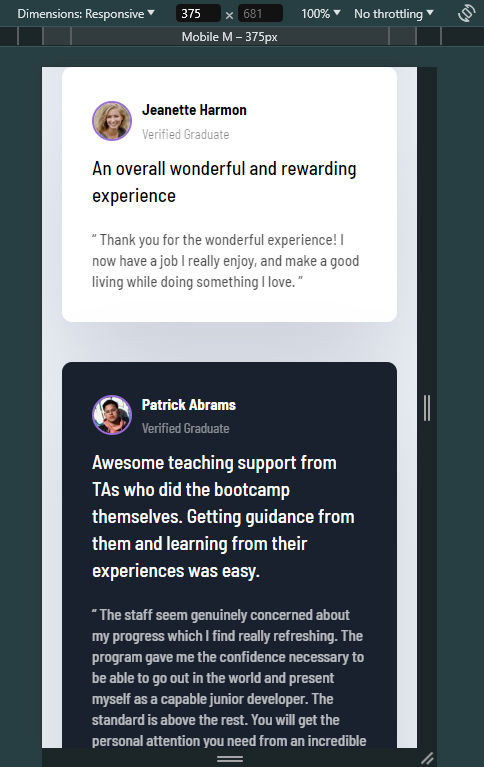

# Frontend Mentor - Testimonials grid section solution

This is a solution to the [Testimonials grid section challenge on Frontend Mentor](https://www.frontendmentor.io/challenges/testimonials-grid-section-Nnw6J7Un7). Frontend Mentor challenges help you improve your coding skills by building realistic projects. 

## Table of contents

- [Overview](#overview)
  - [The challenge](#the-challenge)
  - [Screenshot](#screenshot)
  - [Links](#links)
- [My process](#my-process)
  - [Built with](#built-with)
- [Author](#author)

## Overview

### The challenge

Users should be able to:

- View the optimal layout for the site depending on their device's screen size

### Screenshot

### Links

- Live Site URL: [live site](https://abuzerexe.github.io/Testimonials-Using-CSS-grid-flexbox/)

## My process

### Built with

- Semantic HTML5 markup
- CSS custom properties
- Flexbox
- CSS Grid
- Mobile-first workflow

**Note: These are just examples. Delete this note and replace the list above with your own choices**

### Useful resources

Youtube- [Traversy Media](https://www.youtube.com/@TraversyMedia) 

## Author

- Frontend Mentor - [@abuzerexe](https://www.frontendmentor.io/profile/abuzerexe)
- LinkedIn - [Muhammad Abuzer Zia](https://www.linkedin.com/in/abuzerzia/) 

